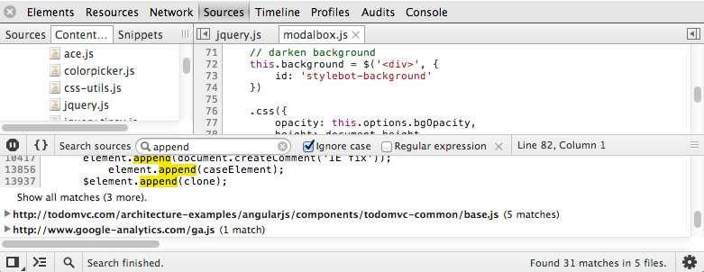
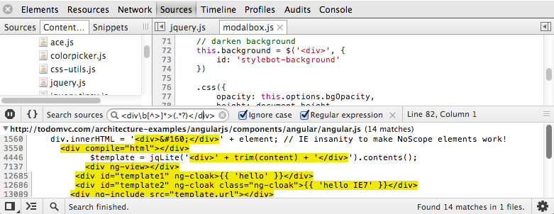
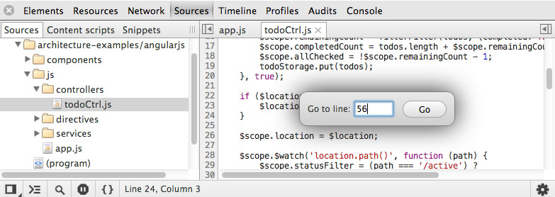
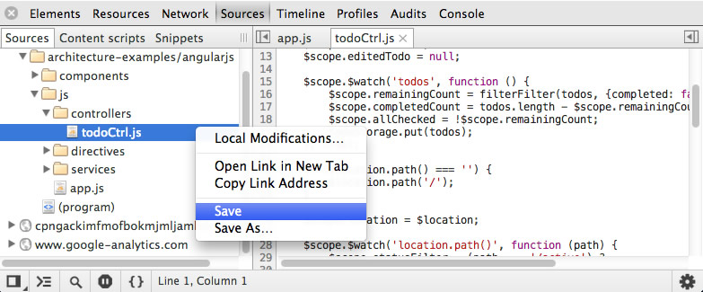
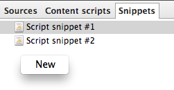
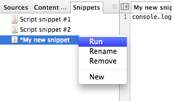

#Chrome开发者工具

##编码与开发流程

开发工作流通常涉及许多步骤用来实现一个目标。当使用开发工具进行编码的时候，可以通过优化工作流程节省时间来完成一般的任务，例如定位文件或函数、编辑脚本或样式、保存常用的代码片段或简单排列布局来更好的满足您的需求。

本节，我们将探讨一些技巧，让您的工作流在开发工具中更加高效。

###开发工具垂直分隔与水平分隔

经常使用开发工具的都知道，开发工具放置在浏览器底部时，我们可以看到更多的水平空间，与此同时，我们看到的垂直空间减少。开发工具附着到浏览器右侧，可以让检查的页面在左侧。

当在下列情景时，非常有用

* 你可能使用一个宽屏显示器,希望最大化可用空间来进行检查和调试代码。
* 你可以改变开发工具的宽度来测试调整布局。
* 垂直分隔对于调试比较长的代码时非常有用。

垂直分隔与水平分隔切换方法：

1.点击左下角Dock to main window按钮切换

2.拖动开发工具进行切换

**注意：**开发工具会记住您最后一次选择。

###搜索、导航与过滤

####通过文件名过滤脚本、样式、代码片段

快速定位到指定的文件，对于一个开发人员来说，是至关重要的。chrome开发工具允许您搜索脚本、样式和文件片段通过下面的快捷键：

* Ctrl+o (window & linux)
* Cmd+o (mac osx)

####在当前文件中搜索文本

* Ctrl+f (window & linux)
* Cmd+f (mac osx)

####在当前文件中替换文本

在搜索关键字右侧，有个Replace的checkbox，选中后，可以进行替换操作

####在所有文件中搜索文本

* Ctrl+shift+f (window & linux)
* Cmd+shift+f (mac osx)

####通过正则表达式搜索

####在一个文件中过滤一个函数或一个选择器

搜索js函数非常快，但选择器还没有试成功（有待完善）。

* Ctrl+shift+o (window & linux)
* Cmd+shift+o (mac osx)

####跳转到指定行

* Ctrl+g (window & linux)
* Cmd+g (mac osx)

###动态编辑脚本与样式

开发工具支持动态编辑脚本与样式，而不需要刷新整个页面。

####脚本

1.单击脚本标签选择脚本

2.资源tab中选择脚本

具体的操作请参照javascript调试部分。

####样式

选择样式资源的方式与脚本相同，我们还可以查看一个元素的样式。

* element.style:元素style属性
* Matched css Rules:所有与该元素匹配的属性，与该元素匹配的选择器会显示为黑色，而与该元素不匹配的元素将显示为灰色，这个可以让我们很快的区分与阅读（特别是当在一堆Sprite合并在一起的时候）。

* 创建新的样式规则
* 切换元素状态
* 颜色显示方式

####保存

###定制javascript代码片段

* 新建

* 运行

也可以打开代码片段后，ctrl+enter运行