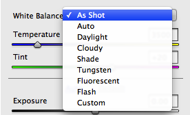
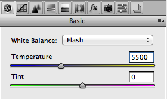
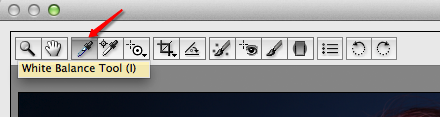
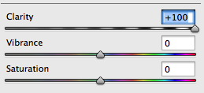
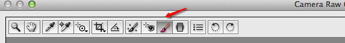

葵花宝典之photoshop数码照片专业处理技法
===

##1.白平衡

先来看看它的基本概念，不管在任何光源下，都能将白色物体还原为白色。

许多人在使用数码摄像机拍摄的时候都会遇到这样的问题：在**日光灯**的房间里拍摄的影像会显得**发绿**，在**室内钨丝灯光**下拍摄出来的景物就会**偏黄**，而在**日光阴影**处拍摄到的照片则莫名其妙地**偏蓝**，其原因就在于“白平衡”的设置上。

调整白平衡的方法：

1.单击白平衡下拉列表(这个列表只适用于raw格式，jpeg和tiff只有原照设置或者自动)

* As Shot:原照设置
* Auto:自动
* Daylight:白光
* cloudy:阴天
* shadow:阴影
* Tungsten:白炽灯
* Fluorescent:荧光灯
* Flash:闪光灯
* Custom:自定

2.使用色温(temperature)与色调(Tint)滑块

移动滑块时，要注意，如果移动后，想恢复原来的位置，只需要双击滑块就可以复位。通常只需要调整色温滑块，很少需要调整色调滑块。

如果需要复位到打开时的样子，只需要在白平衡下拉列表中选择原照设置即可。或者在下面将要介绍的白平衡工具栏上双击也可以。

3.使用白平衡工具

使用方法，只需要使用工具在图片浅灰色区域上单击即可。如不满意，可选择其它位置单击。

	白平衡是一项富有创造性的决策，最重要的是你觉得照片的效果好。你是最后的决策者。
	
##爆光

明天要整理的内容，由于cs5与cs6在爆光设置上的可拖动滑块有所不同，暂时跳过。更新到cs6后进行。

##清晰度

清晰度滑块，基本上是增强中间调的对比度，使图像具有更大的冲击力和影响，它实际上没有锐化图像。需要增加纹理时，加大清晰度。

Clarity:清晰度

几乎所有图片都可以增加清晰度，除非有些主体，你不想增加纹理（比如女人和孩子）。这些例子中，我不会增加纹理，反而会减少清晰度来柔和皮肤。有时并不想或者不能对整张图片进行柔和，这时就需要使用调整画笔来调整了（后面画笔部分再做说明）。

